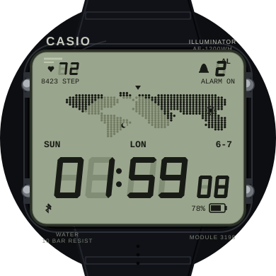

# Casio World Time — Garmin Forerunner 165 watch face

A Garmin Connect IQ **watch face** for the **Forerunner 165 / 165 Music**,
styled after the classic **Casio AE1200WH-1A** ("World Time" / Royale).



## What it shows

| Area | Content |
|------|---------|
| **Top-left** | Live **heart rate + daily steps** (see note below). |
| **Center** | The signature Casio **dot-matrix world map**, kept as a real world map. |
| **Top-right** | **Active alarms** — a bell + the number of alarms currently set. |
| **Bottom** | Large `HH:MM` time with small ticking **seconds**. |
| Under map | Full date (`FRI 6 JUN 2026`). |
| Under time | `SU MO TU WE TH FR SA` strip with today underlined. |

The face uses the cream/green positive-LCD palette of the WH-1A (light
background, dark "ink") and keeps that look on at all times, including the
always-on display.

## Settings (Garmin Connect → Watch Face settings)

- **Force 24-hour clock** — override the system time format.
- **Show seconds** — toggle the ticking seconds counter.

## Two honest hardware notes

1. **Top-left window** — the Forerunner 165 has **no magnetometer**, so no
   live compass heading is available to a watch face. Rather than fake it,
   that window is repurposed as a live activity readout: current **heart
   rate** and **daily step count**. (On a watch with a compass, e.g.
   Fenix/Epix, this could instead be driven by `Sensor` heading.)
2. **Alarms** — Connect IQ exposes only the **number** of active alarms
   (`DeviceSettings.alarmCount`) to a watch face, not the individual alarm
   times. The top-right window shows that count.

## Building & installing

You need the [Connect IQ SDK](https://developer.garmin.com/connect-iq/sdk/)
and a developer key.

```bash
# Generate a signing key once:
openssl genrsa -out developer_key.pem 4096
openssl pkcs8 -topk8 -inform PEM -outform DER -in developer_key.pem \
        -out developer_key.der -nocrypt

# Build a sideloadable .prg for the FR165:
monkeyc -o bin/CasioWorldTime.prg \
        -f monkey.jungle \
        -y developer_key.der \
        -d fr165

# Run it in the simulator:
connectiq            # launch the simulator, then:
monkeydo bin/CasioWorldTime.prg fr165
```

To install on the watch, copy the `.prg` to `GARMIN/APPS/` on the device over
USB, or build an `.iq` package with `monkeyc -e ...` for the Connect IQ Store.

### Quickest path: VS Code

Install the **Monkey C** extension, open this folder, run
**Connect IQ: Build Current Project** (or **Run** to launch the simulator),
and pick **fr165**.

## Project layout

```
manifest.xml                     app id, type=watchface, fr165/fr165m
monkey.jungle                    build config
source/CasioWorldTimeApp.mc      AppBase entry point
source/CasioWorldTimeView.mc     the watch face (all drawing)
resources/strings/strings.xml    UI strings
resources/settings/              user-configurable properties + settings
resources/drawables/             launcher icon
tools/make_icon.py               regenerates the launcher icon (stdlib only)
tools/preview.py                 regenerates preview.svg (stdlib only)
```

`preview.svg` is a mockup that mirrors the on-watch layout and the exact map
data, for previewing without the simulator. The device is the source of truth.
